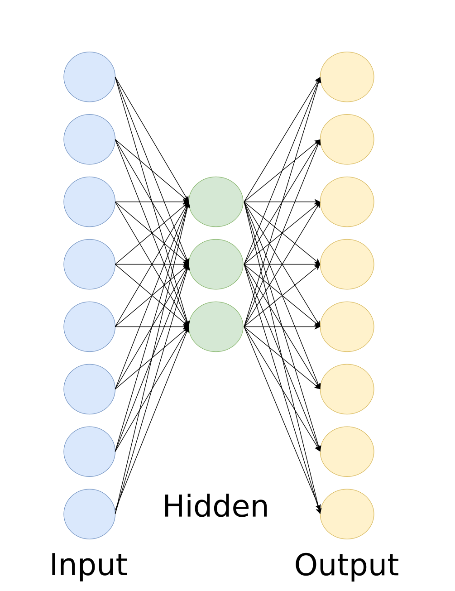

# Simple Neural network
A 3 layer Neural Network. The input consists of 8 elements, the hidden layer uses 3 nodes and the output is 8 elements as well.
Bias is added at the input and hidden layer, the sigmoid function is used for activation.

### How to run
1. Install requirements with `pip install -r requirements.txt`
2. Run using `python3 main.py`

### Graphs
To further investigate the results from the report you can open *plots.hmtl* and *plots_rw.html* with any modern browser.  
New graphs can also be generated with the *graphs.py* and *graphs_rw.py* script. Adjust as you see fitting.

### Performance
The *measure_time.py* script can be used to measure the runtime of the network.
